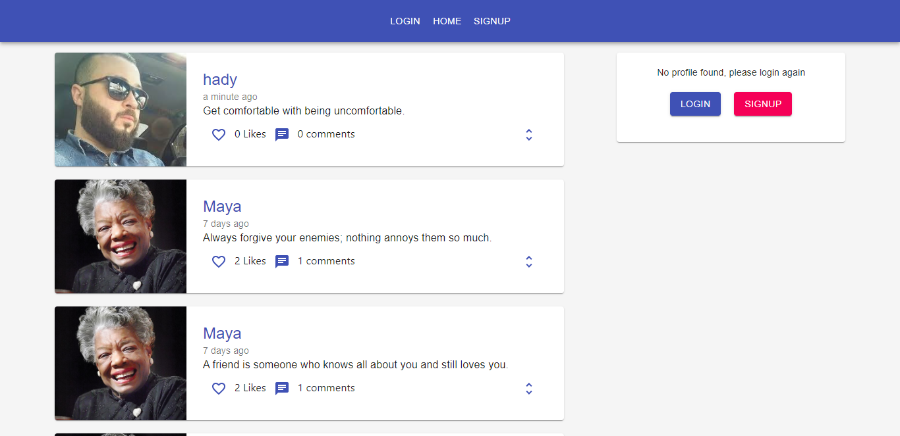
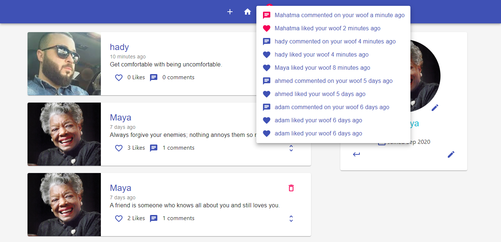
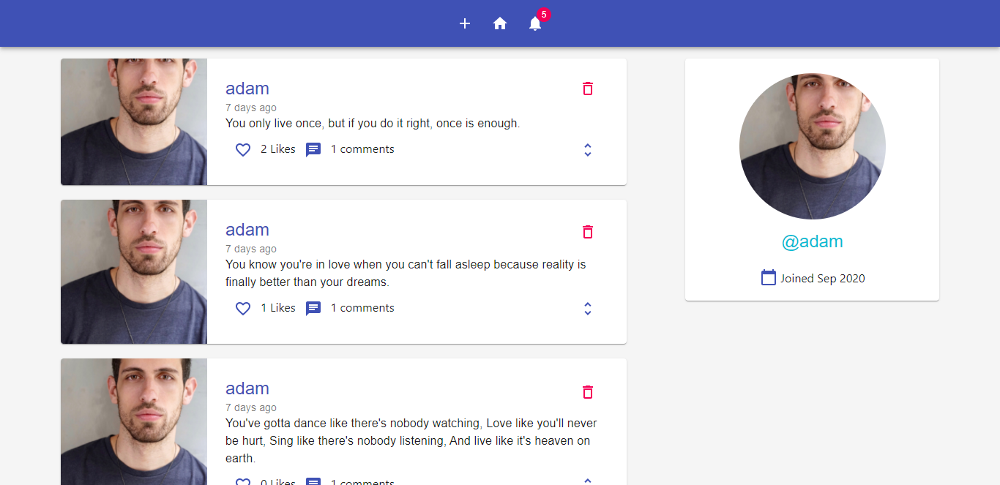
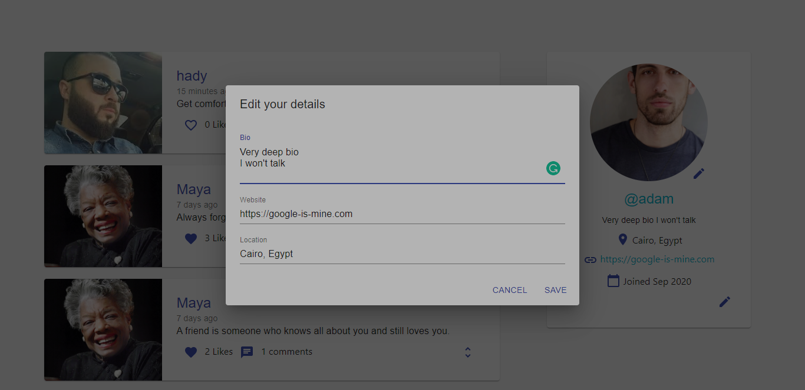
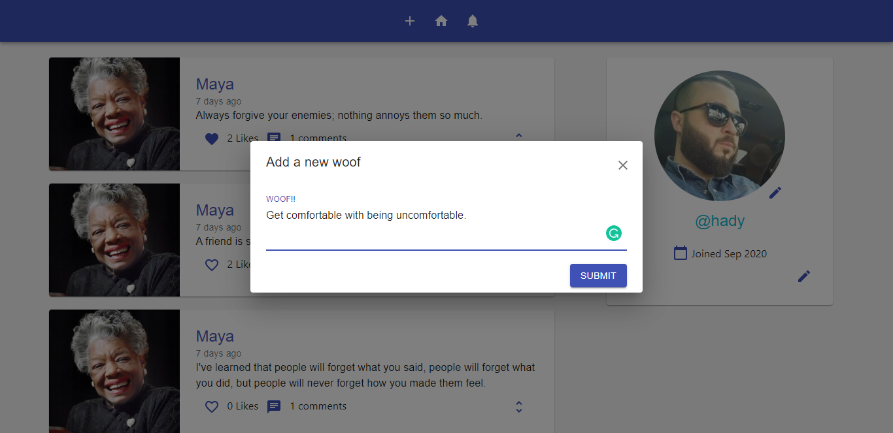

# Woofer API (Backend)

Woofer is a twitter-like application that allows you to post woofs (tweets), see woof details like comments likes, get notifications, see user profiles, edit profile, like and unlike, comment, and do the basic CRUD operations.
Check out the deployed site [here](https://woofer-official.herokuapp.com)

If you are looking for the API - Backend repo, [click here](https://github.com/silvertechguy/woofer-api)
Check out the deployed site [API - Backend](https://woofer-api.herokuapp.com)

## Core Packages

1. react - building user interfaces
2. react-router-dom - routing system
3. redux - managing application state
4. redis - react components design system

## Features

- Signup / Login
- Notifications 🔔
- View Profile
- Upload Photo
- Edit Profile
- New Woof (tweet)
- Like / UnLike
- Comment
- View Woof

### Setup and Install

1. Clone the frontend repo [here](https://github.com/silvertechguy/woofer)
2. Run `npm install`
2. Run `npm start`

## UI

### Home

### Notifications

### Profile

### Edit Profile

### Woof details

### New Woof

👨‍💻 My projects are available at https://silvertechguy.netlify.app

📫 Reach me at my email silvertechguy@gmail.com

twitter https://twitter.com/silvertechyguy
LinkedIn https://linkedin.com/in/silvertechguy

